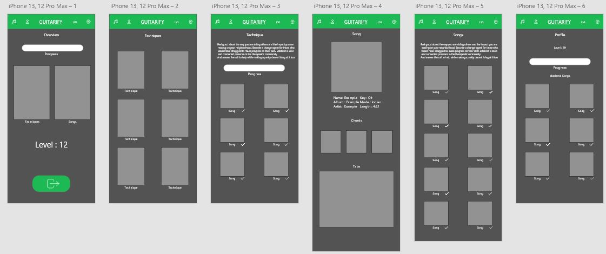

Dokumentation
==============
# Inhalt
- 1	Abstract (Kurzbeschreibung)	2
- 2	Zielpublikum 5
- 3	Sitemap	5
- 4	Navigation 6
- 5	Farbschema 8
- 6	Schriftarten 8
- 7	Fazit 9
 
# 1	Abstract (Kurzbeschreibung)
Beschreibung des gewünschten Projekts:
In diesem Projekt möchten wir mit der Hilfe des Spotify API ein Tool machen indem wir Songs für Anfänger, für fortgeschrittene Anfänger und Experten machen. Wir möchten die Songs abspielen können und dass man die Songs als gelernt markiert und sein Level angibt. Wenn noch Zeit bleibt, möchten wir noch die Tabs synchronisiert angeben sonst einfach den Tab nebenan.

# 1.2 Wer macht was
Wir hatten eigentlich drei Haupaufgaben: Frontend, Backend und Design. Wir hatten darauf geachtet das jeder etwas von den drei Themen macht.

# 1.3 Backstory
Da wir alle leideschaftliche Gitarristen sind war es eigenltich von Anfang an klar das wir etwas mit Gitarren machen wollen. Das mit Spotify kam uns inden sinn da wir dies täglich benutzen und es weiterentwickeln wollten. 

# 2	Zielpublikum

## 2.1	Beschreibung des Zielpublikums
Für den Gitarist der seinen Technischen Skill verbessern möchte und das Übersichtlich.

## 2.2	Konsequenzen bei der Umsetzung
Es darf nicht zu viel sein es muss minimalistisch sein und sauber, übersichtlich.
Keine Bilder dürfen Copyrightet sein.

# 3	Sitemap
Das ist die Mobile Sitemap:

 
# 4	Navigation

## 4.1	Auswahl Mobile
Es hat navigation mit einem menu mit 4 buttons, zum auf die verschiedenen Hauptseiten, auf dem Logo der Person kann ich mich via spotify einloggen. Auf dem Songs tab kann man nach songs suchen. Dann wann man auf techniques klicke geht man auf eine Page mit 8 Technicken wo man auf eine klicken kann.
Die untenstehenden Layouts sind Beispiele. 
## 4.2.1	Desktop
Der Benutzer weiss anhand den Butons oben (Home, Profile, Login, Log out) dass es auf die Seiten geht.
Die Navigation auf der Desktop version wird durch die buttons oben gesteurent wenn man auf Guitarify click geht man aufs home. Der Benutzer weiss anhand der Links die grün sind das man Artist Album anschauen kann.

 
# 5	Farbschema
 
Gedanken zur Auswahl des Farbschemas müssen vorhanden sein (z.B. grün für Natur oder Frühling u.s.w.). Wie wurde das Farbschema erstellt?
## 5.1	Farbe 1 (#1DB954)
Diese Farbe wird für den Hintergrund des Headers benutzt.

## 5.2	Farbe 2 (#FFFFFF)
Diese Farbe wird für den Text benutzt.

## 5.3	Farbe 3 (#535353)
Diese Farbe wird für den Hintergrund jeder page benutzt.

# 6	Schriftarten
Segoe UI, weil sie sauber, minimalistisch und einfach zu lesen ist.
Ich fand es eine gute Idee nur eine Schriftart zu benutzen.

# 7	Fazit
-	Was lief gut/schlecht?
    Das meiste lief gut, wie zum Beispiel das designen und die CSS Dateien, ich hatte aber manchmal Probleme beim Dropdown menu oder beim ändern vom Handy Modus zum Desktop Modus.

-	Haben wir unsere Ziele erreicht? 
    Ja wir haben alle unsere Ziele erreicht, bis auf ein Paar optionale Ziele.

-	Sind wir mit dem Endergebnis zufrieden?
    Ja wir sind eigentlich zufrieden, man könnte noch ins Detail gehen und noch kleine Sachen fixen aber sonst sind wir sehr zufrieden.

-	Was haben wir gelernt?
    Wie man diese HTML GET, POST Methoden benutzt und wie man Node js besser benutzt.

-	Was würden wir nächstes Mal anders machen?
    Wir haben sehr lange am anfang gebruacht zum die ersten paar gets zu machen aber nachdem ging es gut. Also schneller am anfang arbeiten
     
